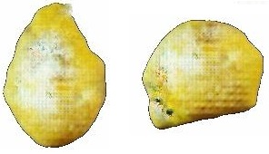
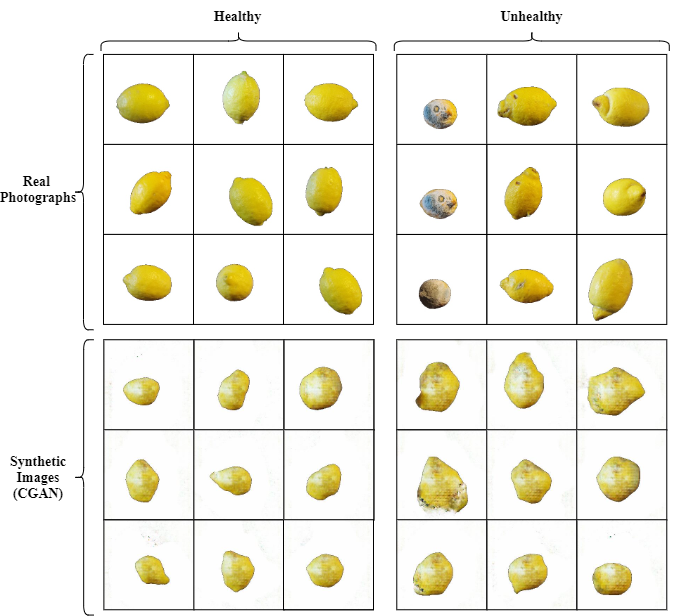
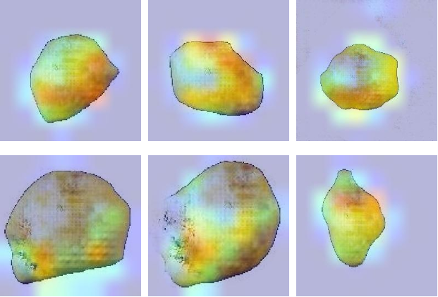

# :lemon: Synthetic Lemon Fruit Image Generator :lemon:


This code utilises a Conditional Generative Adversarial Network which has been trained on healthy and unhealthy lemons 


## :lemon: What does this code do? :lemon:
This program loads a trained CGAN and then can generate synthetic images of either healthy or unhealthy classed lemons. We did this for data augmentation purposes.



Image from our paper: *I'll add a link soon when the preprint is uploaded*

## :lemon: Requirements :lemon:
* NumPy
* Keras
* Matplotlib (if you want to plot the images)

I used NumPy v1.19.3 and Keras v2.4.3 with TensorFlow 2.4.0 backend, but most versions should work. 

## :lemon: How do I use this? :lemon:
Simply run either:
```
python generate_lemons.py --type=healthy
```
or:
```
python generate_lemons.py --type=unhealthy
```

To change the weights, line 44 defines which model to use:
```
model = load_model('lemons_generator_1500.h5')
```
In the form: 'lemons_generator_*epochnum*.h5'

Then, 1000 jpg files will be generated of lemons that are either healthy or unhealthy

## :lemon: Training info :lemon:
The CGAN was trained on 256x256px images for 2000 epochs on an RTX 2080Ti which took around 17 hours. More info is available in the paper below

## :lemon: Analysis :lemon:


In the above image, the top row shows "healthy" lemons and the bottom row shows "unhealthy" lemons. After training a VGG16 CNN on the real dataset, we then provided the images above to the network and used [Grad-CAM](https://arxiv.org/abs/1610.02391) to visualise the class activation maps. Notice that for unhealthy lemons, the class activation is focused moreso on the undesirable characteristics such as mould in the first two and gangrene in the final one. For the healthy lemons, the network seems to focus on the entire fruit which suggests, as we could have guessed, that healthy fruit is classified via its overall shape and form. 

## :lemon: References :lemon:

This model was developed for the following research paper: *I'll add a link soon when the preprint is uploaded*

Trained on the [Lemons quality control dataset](https://github.com/softwaremill/lemon-dataset)

Code written following a tutorial from [Machine Learning Mastery](https://machinelearningmastery.com/how-to-develop-a-conditional-generative-adversarial-network-from-scratch/) - Jason Brownlee's code has been edited to support larger RGB images, and the program requires the definition of the class by the user.

Class activation analysis (code not included) is from [Selvaraju, et al](https://arxiv.org/abs/1610.02391) via the [VGG16 model](https://arxiv.org/abs/1409.1556). A keras tutorial for this can be found [here](https://keras.io/examples/vision/grad_cam/). We analyse *"block5_conv3"* followed by *"block5_pool"*, *"flatten"* (all from VGG16), and then our own layer of 4096 neurons (*"dense_1"*) and output (*"predictions"*).


## :lemon: Licensing :lemon:
You can do whatever you want with my model, it's completely open source. Please cite the following if you use it: *I'll add a link soon when the preprint is uploaded*
